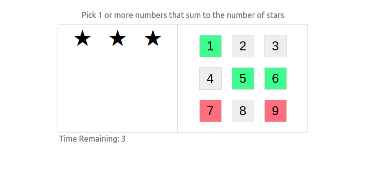
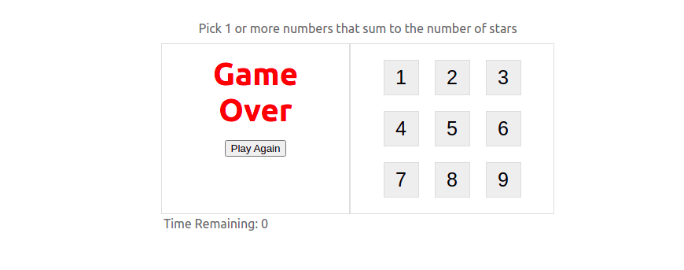

# Stars Match Game
Select a combination from the available numbers sums to the stars number.
Stars are randomly generated from the available numbers combinations.
Try to win before 20 seconds are left out!.


# Setup Guide
```bash
git clone git@github.com:mohamed-abdul-fattah/stars_match.git
cd stars_match
yarn install
yarn start
```
Visit http://localhost:3000/ and play the game.
